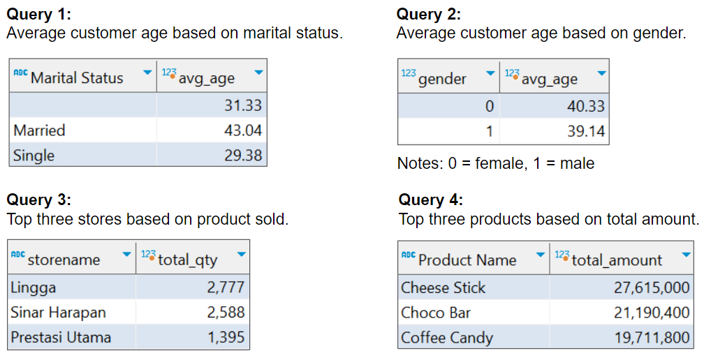

# Sales Quantity Prediction & Customer Segmentation Using ARIMA and K-Means Clustering

## 1. Goals & Objectives
**Goals:**
1. Predict the daily number of sales (quantity) of all Kalbe products in January 2023.
2. Create customer clusters/segments to provide personalized promotions and sales treatment.

**Objectives:**
1. Analyze historical transaction data to discover insights and patterns.
2. Create a machine learning using ARIMA model to predict the daily number of sales and K-Means Clustering to create customer clusters/segments.

## 2. Exploratory Data Analysis
Using SQL and Tableau we will do exploratory data analysis for the transaction data.
### 2.1. SQL

### 2.2. Tableau

[Link to Sales Performance Dashboard](https://public.tableau.com/app/profile/oktavian.dwi.putra/viz/KalbeNutrionals-SalesPerformanceDashboard/Dashboard)

## 3. Sales Quantity Prediction
After we found the parameters for ARIMA model (p = 28, d = 0, q = 28), we can train the model with the data train and make prediction with the data test. We can visualize the result between the actual data and the predictions like in the image below.

We can also use the model to predict the quantity of product needed for sales in January 2023. Based on the prediction result, the number of quantities needed in January 2023 has integer statistic values: 

**Mean: 50, Median: 50, Min: 32, Max: 60, Total: 1545**

## 4. Customer Segmentation

  
  

